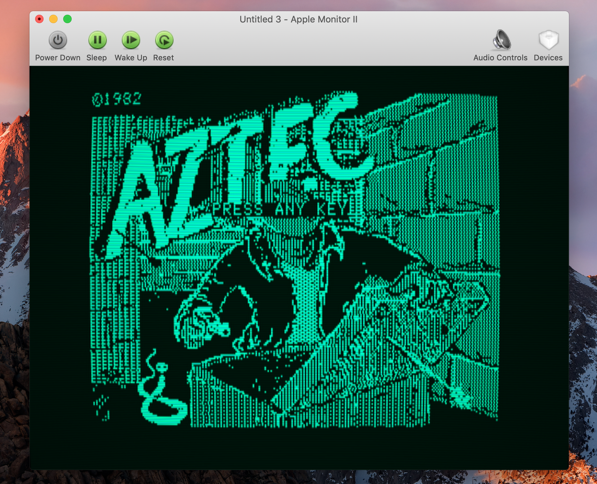

    

---

This is OpenEmulator, a cross-platform emulator of many legacy computer systems.

OpenEmulator is currently only fully supported on Mac OS X, with support for Linux and Windows operating systems being developed. For compilation and installation instructions, refer to [INSTALL.md](https://github.com/openemulator/openemulator/blob/master/INSTALL.md).

## About
OpenEmulator aims to be an accurate, portable emulator of legacy computer systems. By using a software components framework, it is easy to expand a software emulation with additional software devices, just as a real system could be expanded with real devices.

### Features
The approach to this emulator is totally different from other emulators. It focuses on a framework on which many computer systems can be easily emulated. The features that make this possible are:

#### State-of-the-art User Interface
The first pillar of OpenEmulator is a state-of-the-art user interface. Emulations consist of an emulation window that gives you an overview of the installed devices/free ports, and also shows the details and properties of a device. It is thus easy to change the settings of a video monitor, a device's DIP switches or to configure a joystick.

The Hardware Library lets you easily install new devices: just pick a device from the Hardware Library list, and drag it over to an empty port in the emulation window. And all of this even works in real time!

Devices like displays, printers or keypads usually have a separate window. You can display these by clicking on the magnifying buttons.

In order to mount disk or ROM images you simply drag them to a storage device in the emulation window. You can also drag them over to any other window of the emulation or the app icon to let OpenEmulator decide the best device for this operation. To unmount a disk or ROM image press the eject button next to it.

#### Video Rendering
A second pillar is awesome GPU-accelerated video rendering. There is support for accurate CRT and LCD emulations, paper printouts and native OpenGL output.

The effects that are available for video rendering are: NTSC/PAL decoding, standard monitor controls like brightness, contrast, saturation, hue, active video center/size controls, monitor shadow masks like triad, in-line, aperture grille, LCD, Bayer, a CRT barrel effect, CRT dynamic scanline effect, CRT phosphor persistence, CRT center lighting, video bandwidth controls, composite color IRE levels, composite color luma and chroma bandwidth, composite color per-line variable color burst, composite color per-line U phase alternation, composite color Y'UV, Y'IQ (with standard I and Q bandwidth) and Sony decoding.

#### Component Framework
The third pillar of OpenEmulator is a component framework. This feature most likely appeals to computer programmers who want to develop their own emulations. The basis of an OpenEmulator emulation is an XML description called "Emulation Description Language". This is very similar to Java NetBeans and allows the description, connection and configuration of software components. It is thus very easy to interconnect different CPUs, address decoders, memories, chip-sets or input/output devices.

It is also easy to add your own software components to the framework. You are encouraged to submit your own emulations as patches to the OpenEmulator team, so your work gets all the attention it deserves.

## Systems

OpenEmulator emulates the following systems:

- Apple I
    - Original Apple I
	- Replica-1
	- A-ONE
- Apple II
    - Original Apple II
	- Apple II+
	- Apple II Europlus
	- Apple II J-Plus
	
## Feedback

If you find a bug, or would like a specific feature, please report it at:

[https://github.com/openemulator/openemulator/issues](https://github.com/openemulator/openemulator/issues)

If you like to contribute to the project, fork the repository on Github and send us your pull requests!

## License
OpenEmulator is released under the [GNU General Public License v3](https://github.com/openemulator/openemulator/blob/master/COPYING).
	
